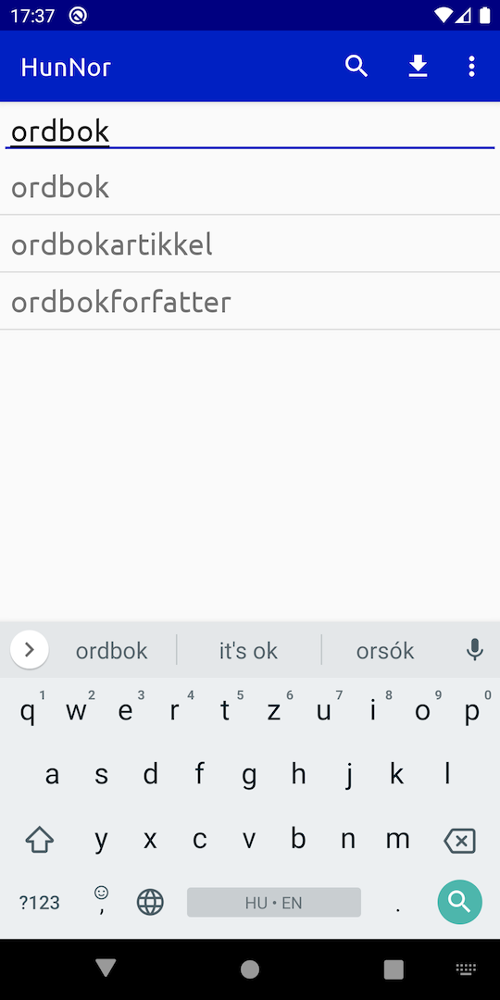
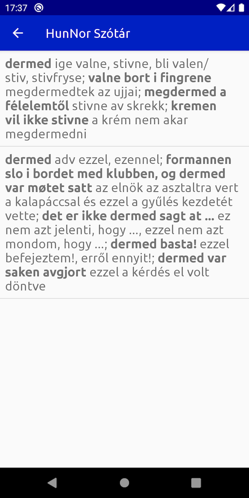

# HunNor for Android

Android application for the HunNor dictionary.

# How to run the app

1. Open the project in Android Studio
1. Download the dictionary data from https://dict.hunnor.net/databases/HunNor-Lucene.zip
1. Save the package as `app/src/main/assets/lucene-index.zip`
1. Run the app

# Project dependencies

The application uses the search module from [`export-lucene`](https://github.com/hunnor-dict/export-lucene), branch `android`.

# Dictionary data

The dictionary is stored as Lucene index and spell checking index directories. Lucene version 3.6.2 is used because of compatibility issues with Android.

# Screenshots

